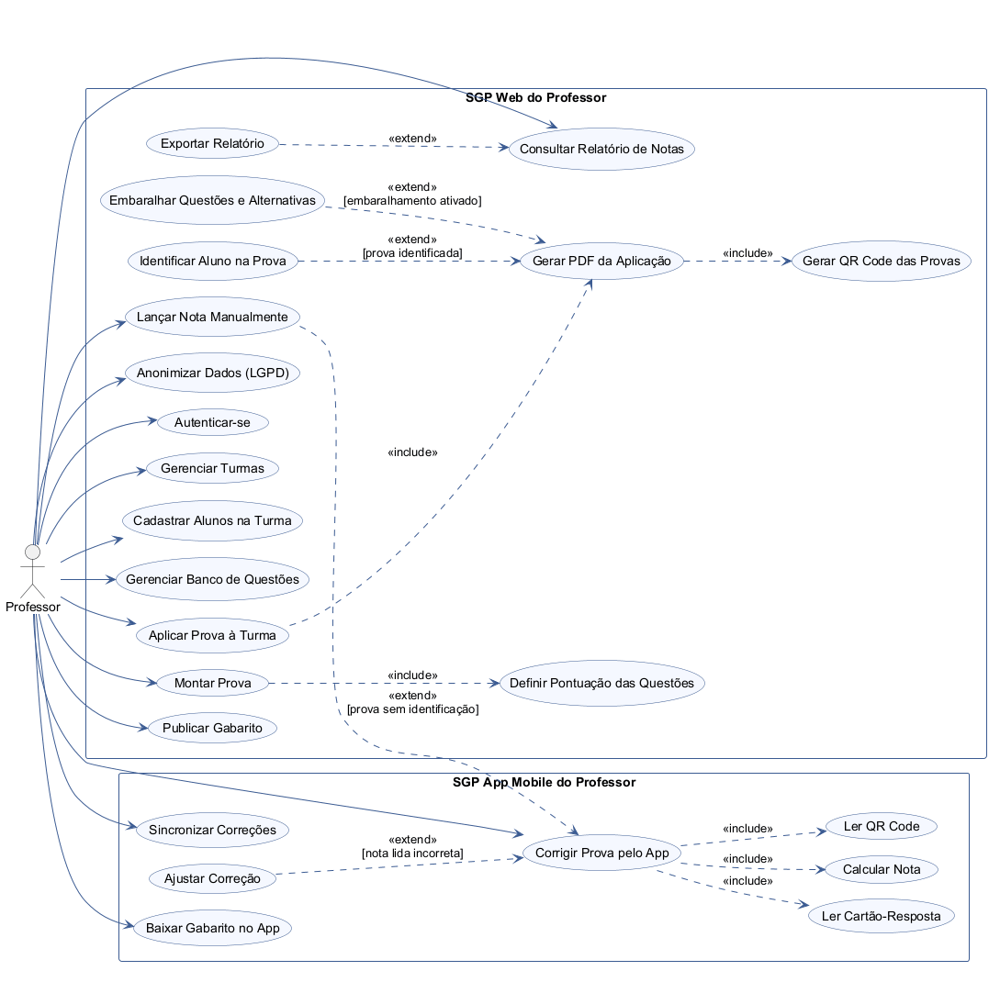

# Diagrama de Caso de Uso do SGP

Este documento segue o formato do exemplo FastBurger dado em aula: primeiro a
análise do [Cenário Base](../README.md#cenário-base), depois o diagrama pronto.

## 1. Diagrama de Casos de Uso

### Passo 1A: Análise do Cenário ("Caça aos Atores e Ações")

Lendo o cenário base, procuramos **quem** interage com o sistema (atores) e
**o que** essa pessoa faz nele (verbos que viram casos de uso).

#### Atores identificados

| Ator | Papel no sistema |
|---|---|
| Professor | Único usuário do SGP. Faz login, cadastra turmas e alunos, monta o banco de questões e as provas, gera o PDF da aplicação, corrige pelo app mobile e consulta/exporta os relatórios de notas. |

**Por que o Aluno não é ator:** ele não faz login, não acessa a web nem o app e
não consulta nota (RF01, RF03). O aluno só aparece como **dado** cadastrado pelo
professor (nome e matrícula) e responde a prova no papel, fora do sistema.

#### Ações encontradas no cenário (casos de uso)

Cada verbo do cenário que representa algo que o Professor faz no sistema virou
um caso de uso. Entre parênteses, o requisito de origem no README.

**SGP Web do Professor**

1. **Autenticar-se** (RF01): "o Professor acessa a plataforma web, faz login".
2. **Gerenciar Turmas** (RF03): "cadastra suas turmas".
3. **Cadastrar Alunos na Turma** (RF03): "e a lista de alunos de cada turma (nome
   e matrícula)".
4. **Gerenciar Banco de Questões** (RF02): "monta um banco de questões objetivas e
   discursivas".
5. **Montar Prova** (RF04): "cria provas com até 20 questões, definindo a
   pontuação de cada uma".
6. **Aplicar Prova à Turma** (RF05): "para aplicar a prova, o Professor escolhe a
   turma".
7. **Gerar PDF da Aplicação** (RF06, RF07): "o sistema gera um PDF único com todas
   as versões e um QR Code em cada prova".
8. **Publicar Gabarito** (RF11): gabarito por versão ou por aplicação, para a
   devolutiva do professor ao aluno.
9. **Lançar Nota Manualmente** (RF09): "se não [era identificada], o Professor
   lança a nota manualmente na web depois".
10. **Consultar Relatório de Notas** (RF12): "consulta o relatório de notas da
    turma, com média e estatísticas".
11. **Exportar Relatório** (RF12): "e exporta em planilha para lançar no sistema
    acadêmico".
12. **Anonimizar Dados (LGPD)** (RF13): anonimização da conta do professor e dos
    alunos vinculados, preservando o histórico de notas.

**SGP App Mobile do Professor**

13. **Baixar Gabarito no App** (RF10): "o aplicativo no celular, que já baixou o
    gabarito e funciona sem internet".
14. **Corrigir Prova pelo App** (RF08): "lê o QR Code e o cartão-resposta de cada
    prova pela câmera, confere a nota calculada automaticamente e confirma".
15. **Sincronizar Correções** (RF10): "quando o celular volta a ter internet, as
    correções são sincronizadas".

Os casos de uso foram separados em **dois retângulos de sistema** porque a
correção por câmera (e tudo que depende dela) só existe no app mobile, enquanto
o cadastro, a montagem de provas e os relatórios só existem na web.

**Sobre o Autenticar-se:** ele é pré-condição de todos os outros casos de uso
(nenhuma tela funciona sem login), então foi ligado direto ao Professor em vez de
receber uma seta `<<include>>` de cada caso, o que deixaria o diagrama ilegível.
O app mobile usa a mesma conta do professor.

### Passo 1B: Relacionamentos include/extend

Depois de listar os casos de uso, perguntamos para cada um: "isso **sempre**
acontece junto com outro caso?" (`<<include>>`) ou "isso **só às vezes**
acontece, dependendo de uma condição?" (`<<extend>>`).

#### `<<include>>`: obrigatório, sempre acontece junto

A seta sai do caso base e aponta para o caso incluído.

| Caso base | Inclui | Por quê |
|---|---|---|
| Montar Prova | Definir Pontuação das Questões | Toda questão da prova precisa de pontuação (RF04). |
| Aplicar Prova à Turma | Gerar PDF da Aplicação | Aplicar a prova é justamente gerar o PDF para aquela turma (RF05, RF06). |
| Gerar PDF da Aplicação | Gerar QR Code das Provas | Toda prova do PDF sai com QR Code, senão o app não consegue corrigir (RF07). |
| Corrigir Prova pelo App | Ler QR Code | O QR Code diz ao app qual aplicação e versão está sendo corrigida (RF08). |
| Corrigir Prova pelo App | Ler Cartão-Resposta | Sem ler as respostas marcadas não há correção (RF08). |
| Corrigir Prova pelo App | Calcular Nota | A nota é sempre calculada automaticamente comparando com o gabarito (RF08). |

#### `<<extend>>`: opcional ou condicional

A seta sai do caso que **estende** e aponta para o caso base. Entre colchetes
está a condição em que a extensão acontece.

| Caso que estende | Caso base | Condição |
|---|---|---|
| Embaralhar Questões e Alternativas | Gerar PDF da Aplicação | O professor ativou o embaralhamento na configuração (RF06). |
| Identificar Aluno na Prova | Gerar PDF da Aplicação | O professor escolheu gerar provas identificadas com o nome do aluno (RF06). |
| Ajustar Correção | Corrigir Prova pelo App | A nota lida está errada e o professor corrige antes de confirmar (RF08). |
| Lançar Nota Manualmente | Corrigir Prova pelo App | A prova **não** era identificada, então a nota não vai direto para o aluno e o professor lança depois na web pelo nome/matrícula escritos na folha (RF09). |
| Exportar Relatório | Consultar Relatório de Notas | Só quando o professor quer a planilha para lançar no sistema acadêmico (RF12). |

Embaralhar e Identificar ficaram como `<<extend>>` (e não `<<include>>`) porque
são **opções** da geração do PDF: o professor pode gerar sem embaralhar e sem
identificar, e o PDF continua sendo gerado normalmente.

### Diagrama de Caso de Uso

Código-fonte em PlantUML: [caso-de-uso.puml](caso-de-uso.puml).

