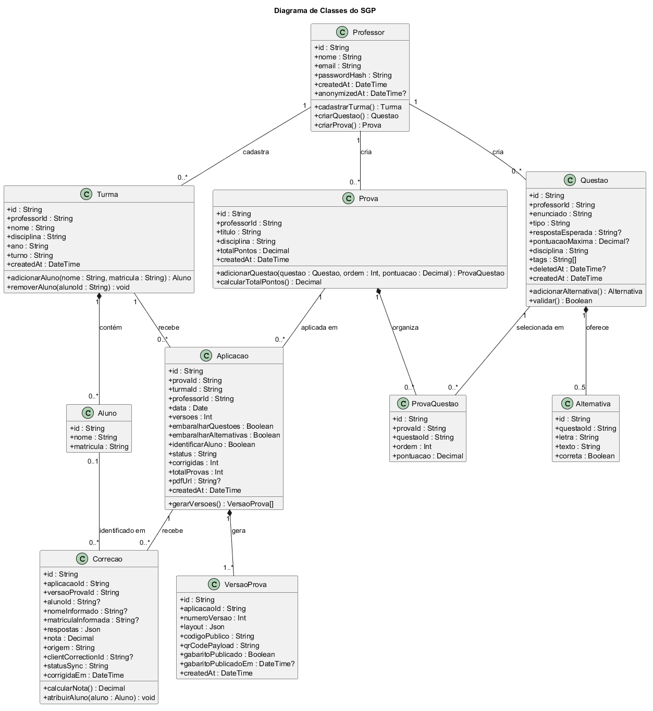

## 3. Diagrama de Classes

### Passo 3A: Extração do Texto ("Truque do Detetive")

#### Identificando as classes (substantivos)

Partindo dos substantivos do cenário base, identificamos as classes abaixo. Os nomes
e atributos seguem os tipos usados pelas telas e o schema planejado no Prompt 0.
`Aluno` mantém somente `id`, `nome` e `matricula`, conforme a regra de escopo.

| Classe | Descrição |
|---|---|
| Professor | Usuário que acessa o sistema, cadastra turmas, questões e provas. |
| Turma | Grupo de alunos de uma disciplina, ano e turno, pertencente a um professor. |
| Aluno | Registro de nome e matrícula dentro de uma turma; não tem acesso ao sistema. |
| Questao | Questão objetiva ou discursiva do banco do professor. |
| Alternativa | Opção de resposta de uma questão objetiva, marcada como correta ou incorreta. |
| Prova | Modelo reutilizável com título, disciplina e questões selecionadas. |
| ProvaQuestao | Associação entre prova e questão, que guarda ordem e pontuação naquela prova. |
| Aplicacao | Preparação da prova para uma turma, com data e configuração de versões. |
| VersaoProva | Uma versão gerada para uma aplicação, com layout, gabarito e identificadores públicos. |
| Correcao | Resultado da leitura ou do lançamento manual de uma prova respondida. |

#### Interpretando associações e multiplicidades

A pergunta-chave é: **“Quantos desse podem estar ligados a aquele?”**

- **Professor e Turma:** 1 professor tem 0..* turmas; cada turma é de 1 professor.
- **Professor e Questao:** 1 professor cadastra 0..* questões; cada questão pertence a 1 professor.
- **Professor e Prova:** 1 professor cria 0..* provas; cada prova pertence a 1 professor.
- **Turma e Aluno:** composição, 1 turma contém 0..* alunos; cada aluno pertence a 1 turma e deixa de existir no sistema quando removido da turma.
- **Questao e Alternativa:** composição, 1 questão tem 0..5 alternativas; cada alternativa pertence a 1 questão. Questões objetivas têm de 2 a 5 alternativas; discursivas não têm alternativas.
- **Prova e Questao:** muitos para muitos, resolvido pela classe `ProvaQuestao`, que guarda ordem e pontuação; uma prova tem até 20 questões. Cada registro de associação aponta para 1 prova e 1 questão.
- **Prova e Aplicacao:** 1 prova pode estar em 0..* aplicações; cada aplicação usa 1 prova.
- **Turma e Aplicacao:** 1 turma pode receber 0..* aplicações; cada aplicação é destinada a 1 turma.
- **Aplicacao e VersaoProva:** composição, 1 aplicação gera 1..* versões; cada versão pertence a 1 aplicação.
- **Aplicacao e Correcao:** 1 aplicação tem 0..* correções; cada correção pertence a 1 aplicação.
- **Correcao e Aluno:** cada correção pode estar ligada a 0..1 aluno; um aluno pode ter 0..* correções. A associação fica vazia quando a prova não foi identificada e é preenchida no lançamento manual.

### Diagrama de Classes

